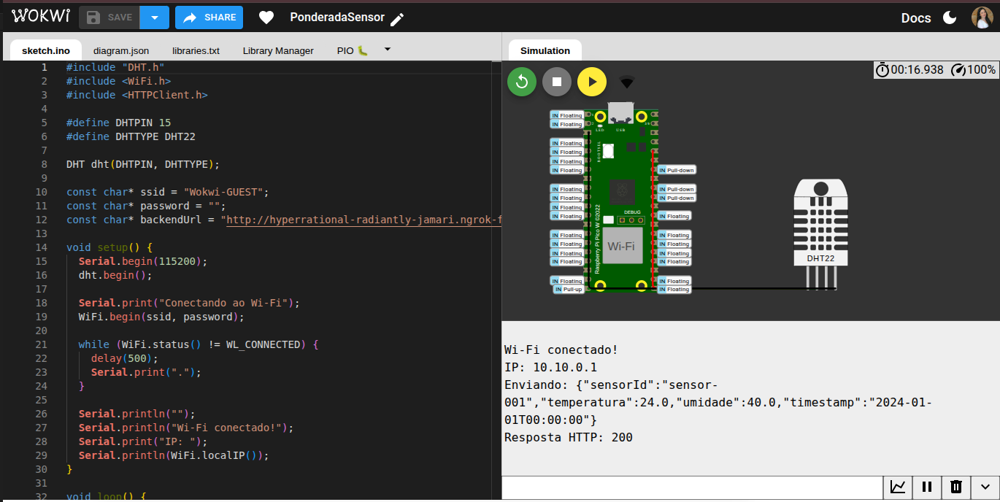
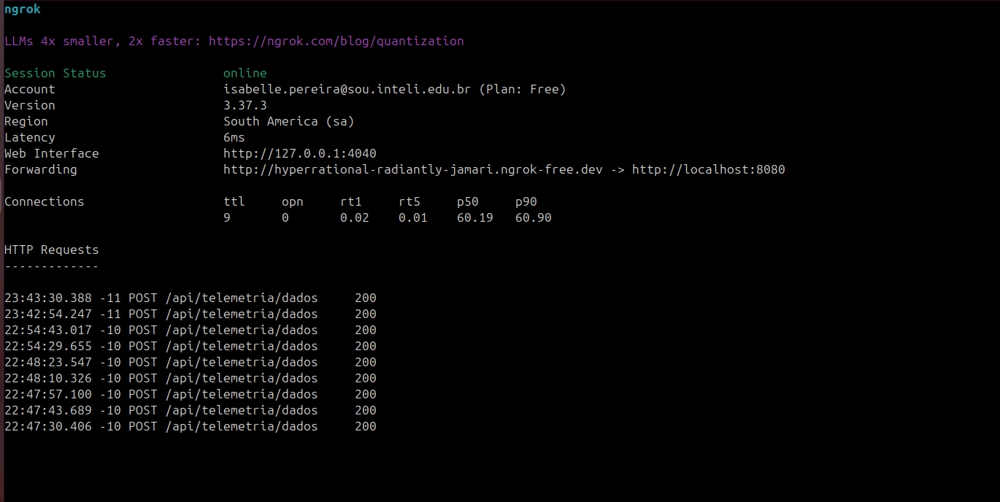
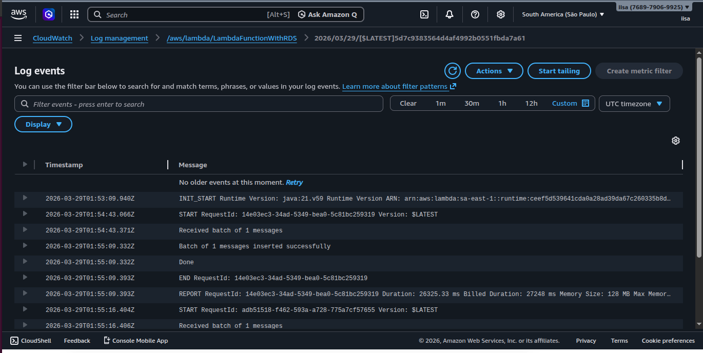

# Atividade 2 — Integração com Raspberry Pi Pico W

Firmware embarcado desenvolvido para o **Raspberry Pi Pico W** com o objetivo de coletar dados de sensores e enviar telemetria ao sistema backend desenvolvido na Atividade 1 para acessar mais detalhes acesse a [documentação](https://iisabelledantas.github.io/PonderadaLista/).

## Framework 

| Item | Descrição |
|------|-----------|
| **Framework** | Arduino Framework |
| **Plataforma de simulação** | [Wokwi](https://wokwi.com) |
| **Linguagem** | C++ (Arduino) |
| **Bibliotecas utilizadas** | `DHT sensor library` (Adafruit), `WiFi.h`, `HTTPClient.h` (nativas do Arduino para Pico W) |


## Sensores Integrados

### DHT22 — Temperatura e Umidade

| Parâmetro | Valor |
|-----------|-------|
| **Tipo** | Digital (protocolo single-wire) |
| **Pino de dados (SDA)** | GP15 |
| **Alimentação (VCC)** | 3.3V |
| **GND** | GND |
| **Range de temperatura** | -40°C a +80°C  |
| **Range de umidade** | 0% a 100% RH |

## Diagrama de Conexão

```
Raspberry Pi Pico W          DHT22
┌─────────────────┐         ┌──────────┐
│                 │         │          │
│  3V3 (pino 36) ─┼─────────┼─ VCC     │
│                 │         │          │
│  GP15 (pino 20)─┼─────────┼─ SDA     │
│                 │         │          │
│  GND (pino 38) ─┼─────────┼─ GND     │
│                 │         │          │
└─────────────────┘         └──────────┘
```

### Configuração no `diagram.json` (Wokwi)

```json
{
  "version": 1,
  "author": "Isabelle Pereira",
  "editor": "wokwi",
  "parts": [ 
    { "type": "board-pi-pico-w", "id": "pico", "top": 0, "left": 0, "attrs": {} },
    { "type": "wokwi-dht22", "id": "dht1", "top": 80, "left": 220, "attrs": {} }
    ],
  "connections": [ 
    [ "dht1:VCC", "pico:3V3", "red", [] ],
    [ "dht1:SDA", "pico:GP15", "green", [] ],
    [ "dht1:GND", "pico:GND.1", "black", [] ]
    ],
  "dependencies": {}
}
```

## Configuração de Rede

### Simulação no Wokwi

O Wokwi disponibiliza uma rede Wi-Fi simulada. Utilize as credenciais abaixo:

```cpp
const char* ssid     = "Wokwi-GUEST";
const char* password = "";
```

### Ambiente real / backend local

Para expor um backend rodando em `localhost` ao Wokwi (que executa na nuvem), utilize o **ngrok**:

```bash
ngrok config add-authtoken SEU_TOKEN

ngrok http 8080 --scheme http
```

A URL gerada (ex: `http://xxxx.ngrok-free.dev`) deve ser usada como `backendUrl` no firmware.

### Endpoint esperado pelo backend

| Campo | Valor |
|-------|-------|
| **Método** | `POST` |
| **Rota** | `/api/telemetria/dados` |
| **Content-Type** | `application/json` |

### Payload enviado

```json
{
  "sensorId": "sensor-001",
  "temperatura": 24.0,
  "umidade": 40.0,
  "timestamp": "2024-01-01T00:00:00"
}
```

## Evidências de Funcionamento
 
### 1. Simulação no Wokwi — Firmware em execução
 
<div style="display: flex; align-items: center; gap: 8px;">
  
</div>
 
A imagem acima mostra o firmware em plena execução no Wokwi. À esquerda, o código do [sketch.ino](sketch.ino) com as configurações de Wi-Fi e a URL do backend via ngrok. À direita, a simulação exibe o **Raspberry Pi Pico W** conectado ao sensor **DHT22** e o monitor serial com as seguintes saídas:
 
```
Wi-Fi conectado!
IP: 10.10.0.1
Enviando: {"sensorId":"sensor-001","temperatura":24.0,"umidade":40.0,"timestamp":"2024-01-01T00:00:00"}
Resposta HTTP: 200
```
 
A resposta **HTTP 200** confirma que o payload foi montado corretamente e entregue com sucesso ao backend.
 
---
 
### 2. ngrok — Requisições recebidas com sucesso
 
<div style="display: flex; align-items: center; gap: 8px;">
  
</div>
 
O terminal do ngrok evidencia o tráfego real entre o Wokwi e o backend local. São visíveis **9 conexões** registradas (`ttl: 9`), com múltiplas requisições `POST /api/telemetria/dados` retornando status **200**, confirmando que os dados chegaram corretamente ao endpoint a cada ciclo de envio do firmware (a cada 5 segundos):
 
```
23:43:30.388  POST /api/telemetria/dados  200
23:42:54.247  POST /api/telemetria/dados  200
22:54:43.017  POST /api/telemetria/dados  200
...
```
 
O túnel estava configurado em modo HTTP puro (`--scheme http`), redirecionando `http://hyperrational-radiantly-jamari.ngrok-free.dev` para `http://localhost:8080`.
 
### 3. AWS CloudWatch — Logs de processamento no backend
 
<div style="display: flex; align-items: center; gap: 8px;">
  
</div>
 
Os logs do **Amazon CloudWatch** confirmam o processamento dos dados no backend hospedado na AWS (Lambda com Java 21). Para cada requisição recebida do Pico W, o sistema registrou o ciclo completo de execução:
 
| Timestamp | Evento |
|-----------|--------|
| `2026-03-29T01:54:43.066Z` | `START` — Lambda inicializada |
| `2026-03-29T01:54:43.371Z` | `Received batch of 1 messages` — payload recebido |
| `2026-03-29T01:55:09.332Z` | `Batch of 1 messages inserted successfully` — dados gravados |
| `2026-03-29T01:55:09.332Z` | `Done` — execução concluída |
| `2026-03-29T01:55:09.393Z` | `END` — função encerrada |
 
A duração total de processamento foi de aproximadamente 26 segundos, incluindo o tempo de inserção no banco de dados. O segundo ciclo (`START RequestId: adb51518`) confirma que o firmware continuou enviando telemetria periodicamente, sendo processado com sucesso a cada envio.
 